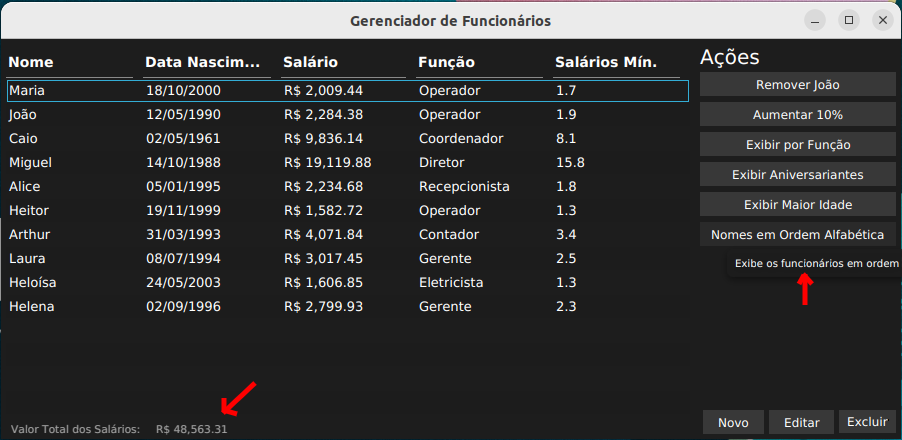
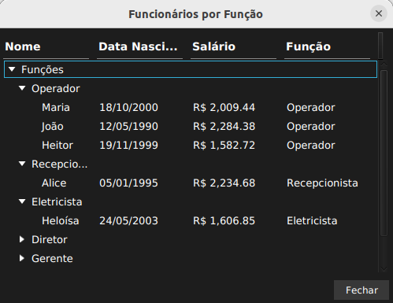
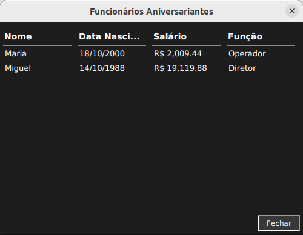
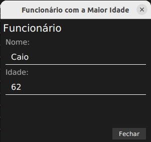
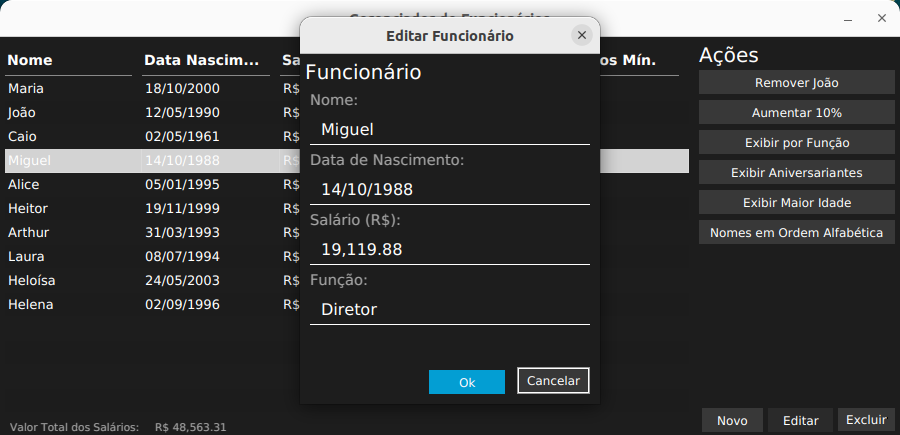

# CRUD de Funcionários em JavaFX

## Executando o projeto

### Pré-requisitos

Esse projeto assume que o Java esteja devidamente instalado na máquina e com a variável de ambiente JAVA_HOME configurada.

### Execução

1. Clone o projeto via Git ou simplesmente faça o download pelo GitHub.
2. Descompacte o projeto do arquivo ".zip".
3. Navegue até pasta raiz do projeto.
4. Se estiver no **Windows**, execute o arquivo **"run.cmd"**. Se estiver no **Linux**, execute o arquivo **"run.sh"**.

## Telas da Aplicação

Como indicado pelas setas no *print* anterior, há informações no rodapé da tela e cada botão na seção "Ações" há um *tooltip* informativo.

Os *prints* a seguir ilustram que há funcionalidades (botões na seção "Ações") que abrem novas telas para mostrar a informação de forma mais organizada. 

Há também como criar, editar e excluir funcionários pelos botões na parte inferior direita da Tela Inicial (primeiro *print*). O *print* a seguir ilustra o formulário de cadastro/edição.

